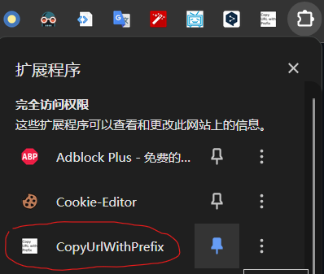
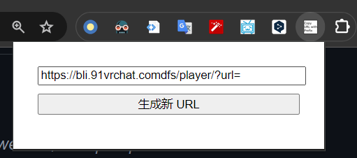
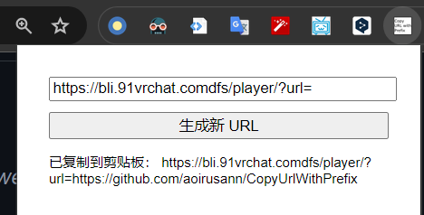

# 这是什么？
将当前标签页的url和一个给定的前缀拼接，然后将新的url复制到剪贴板的偷懒用chrome插件。

# 如何使用？
1. 将该插件固定：
2. 点击该插件的图标，然后填入前缀url：
3. 点击`生成新URL`：

# 如何安装？
1. chrome地址栏中输入`chrome://extensions/`
2. 右上角启用`开发者模式`
3. 单击`加载已解压的扩展程序`
4. 选择该目录（`manifest.json`所在的目录）